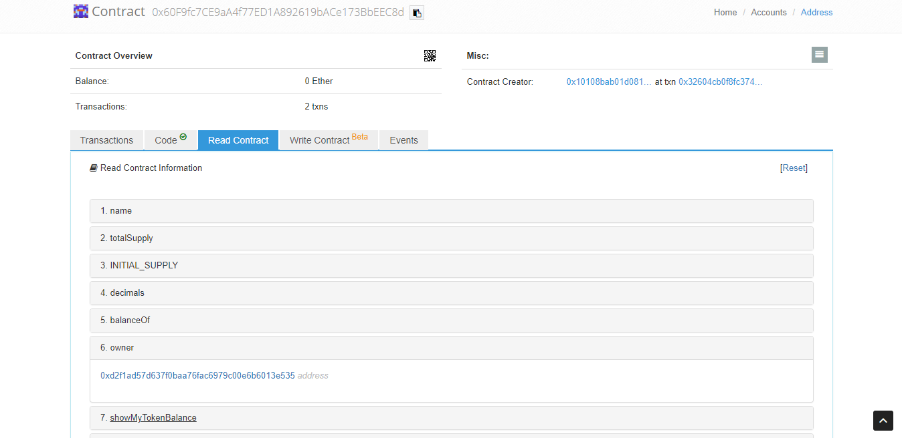

# New Vulnerabilities Allow Anyone to Own Certain ERC20-Based Smart Contracts(CVE-2018-19830, CVE-2018-19831, CVE-2018-19832, CVE-2018-19833, CVE-2018-19834)

## Abstract

This week, our vulnerability-scanning system, Solify, identified several new vulnerabilities which allow anyone to own certain ERC20-based smart contracts, such as [NewIntelTechMedia](https://etherscan.io/token/0xe30a76ec9168639f09061e602924ae601d341066), which is deployed by a decentralized media platform – New Intel Tech Media[https://www.netmchain.com/]. Those bugs, if successfully exploited, might cause serious financial losses.

## Details

As we know, Solidity provides function modifiers, which can be used to restrict who can make modifications to your contract’s state or call the contract’s functions. The most common modifier is like `onlyOwner` below:

```solidity
contract Ownable {
  address public owner;

  function Ownable() public {
    owner = msg.sender;
  }

  modifier onlyOwner() {
    require(msg.sender == owner);
    _;
  }

  function transferOwnership(address newOwner) onlyOwner public {
    require(newOwner != address(0));
    OwnershipTransferred(owner, newOwner);
    owner = newOwner;
  }
  
  function withdraw() onlyOwner public {
    uint256 etherBalance = address(this).balance;
    owner.transfer(etherBalance);
  }
}
```

So sensitive functions can use the `onlyOwner` modifier to guarantee that only the current contract owner can call them. But this protection doesn't work if some attacker is regarded as the owner of this contract. What's worse, for important functions such as `withdraw()` and `withdrawForeignTokens()`, attackers can call these sensitive functions after taking the ownership of this contract.


We found several cases of unexpected ownership transfer caused by unconsidered code design.


### Mismatch between Contract Name and Constructor

ERC20 token BAFC uses wrong constructor, which enables anyone to own this contract (CVE-2018-19830). The related code is listed below:

```solidity
contract BAFCToken is StandardToken {
    string public name = "Business Alliance Financial Circle";
    string public symbol = "BAFC";
    uint public decimals = 18;
    /**
     * CONSTRUCTOR, This address will be : 0x...
     */
    function UBSexToken() {
        owner = msg.sender;
        totalSupply = 1.9 * 10 ** 26;
        balances[owner] = totalSupply;
    }

    function () public payable {
        revert();
    }
}
```

The contract name is `BAFCToken` while the constructor is falsely named as `UBSexToken`, which causes it to be a public function by default. So anyone who invokes this function will own this contract.

ERC20 token NETM has a similar problem (CVE-2018-19832) that the contract name is `NewIntelTechMedia` while there is a constructor-like function called `NETM`. Actually this function is also a public function and can be easily utilized.

```solidity
contract NewIntelTechMedia is ERC20 {
    ...
    string public constant name = "NewIntelTechMedia";
    string public constant symbol = "NETM";
    ...
    function NETM() public {
        owner = msg.sender;
        balances[owner] = totalDistributed;
    }
    ...
}
```


### Unprotected Ownership Transfer Function


Some functions which can be used to change the ownership of the contracts are not properly protected, so attackers can easily use these functions to become the owner of the contracts.

ERC20 token CBN (CVE-2019-19831)

```solidity
function ToOwner() public {
    balances[msg.sender] = totalSupply;
    owner = msg.sender;
}    
```

ERC20 token CBN (CVE-2019-XXXXX)

```
function Mining24 (uint256 _value, uint256 _minReq) public {
    owner = msg.sender;
    value = _value;
    minReq = _minReq;
    balances[msg.sender] = totalDistributed;
}
```

ERC20 token DDQ (CVE-2018-19833)

```
function owned() public {
    owner = msg.sender;
}
```


RC20 token BOMBBA (CVE-2019-19831)

```solidity
function quaker(address wallet) public {
    owner = msg.sender;
    ownerWallet=wallet;
    totalSupply = INITIAL_SUPPLY * 10 ** 18;
    tokenBalances[wallet] = INITIAL_SUPPLY * 10 ** 18;
}
```

## Exploit

To confirm these vulnerabilities, we deployed these smart contracts in the testnet and sent a transaction to invoke the `setOwner` function to change the owner of the contract, which enable us to do sensitive operations like transfering tokens freely.

Before the exploit, the owner is '0x10108bab01d0811f233b703dccb005db27df764f', which is the contract creator.


And owner is changed to '0xa4afe8bc10c32e8e0ca9db6f982e4d9490045407' after the exploit.



The figure shows the exploit transaction[1].


## Consequences

With these bugs to essentially change the smart contract ownership, attackers can access any sensitive operations restricted by `onlyOwner` and thereby transfer all the value in these contracts.

## References

- [1] Exploit transaction: [https://ropsten.etherscan.io/tx/0x278da1f0e48234f80ac1b6cb9e73a6bbaaa85fc31ca012ec430c7346c3eef00c#decodetab]
